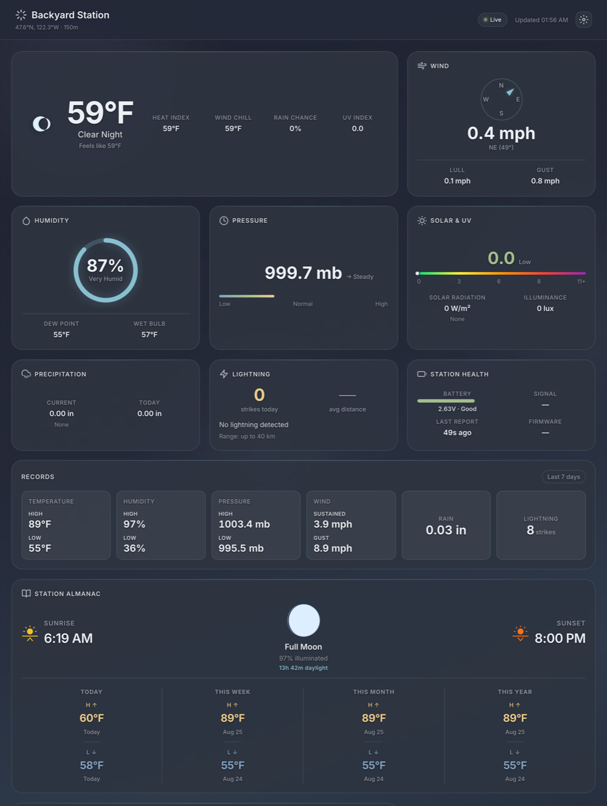

# Stormglass

A self-hosted appliance for [WeatherFlow Tempest](https://weatherflow.com/tempest-home-weather-system/)
weather stations. Point it at your station's UDP broadcasts and it gives you a
live dashboard, a durable observation history, and Prometheus metrics — with no
WeatherFlow account, no API token, and no cloud dependency.



## What it does

- **Live dashboard** — current conditions, wind compass, humidity, pressure,
  solar & UV, precipitation, lightning and station health, plus a records strip
  and a station almanac. Embedded in the binary; no separate web server.
- **Stores your history** — SQLite by default (with optional Litestream
  replication), PostgreSQL if you want it, or both at once.
- **Exports Prometheus metrics** — scrape endpoint, push gateway, or OpenTelemetry.
- **Backfills gaps** — a `backfill` subcommand fills holes in local history from
  the Tempest REST API, if you have a token.
- **Optional radar** — NEXRAD Level II tiles rendered by a sidecar.

Everything except backfill works with **no WeatherFlow credential at all** — the
station broadcasts on your LAN, and Stormglass listens.

## Quick start

```bash
docker run -d --name stormglass \
  --net=host \
  -v stormglass-data:/data \
  ghcr.io/jacaudi/stormglass
```

Open <http://localhost:8080>.

Two things about that command are not optional:

- **`--net=host` is required.** Tempest stations broadcast to UDP :50222 as
  link-local traffic. Docker's default bridge network does not deliver those
  broadcasts to the container, so without host networking Stormglass starts
  cleanly and then sits there receiving nothing.
- **`/data` must be writable.** SQLite is the default store, and if the database
  cannot be opened the process **exits at startup** rather than silently running
  without persistence. The named volume above satisfies this; so does
  `SQLITE_PATH` pointed somewhere writable.

The first observation usually lands within a minute — Tempest stations report
about once per minute, with rapid-wind samples every three seconds.

## Storage

Stormglass always writes observations somewhere. Which store is a config choice,
and the two are not exclusive.

| Configuration | What happens |
|---|---|
| *(nothing set)* | **SQLite** at `/data/stormglass.db` — the default |
| `ENABLE_POSTGRES=true` + `SQLITE_PATH` set | **Both** — every observation is written to each (fan-out) |
| `ENABLE_POSTGRES=true`, `SQLITE_PATH` unset | **PostgreSQL only** — no local database |

There is no flag to turn storage off. To avoid a local database entirely, make
Postgres the sole store.

Both stores use the same four tables — `stormglass_observations`,
`stormglass_rapid_wind`, `stormglass_hub_status`, `stormglass_events` — with
UUIDv7 primary keys. Schema is created automatically at startup.

**SQLite specifics.** Pure-Go driver (`modernc.org/sqlite`, no CGO), WAL journal
mode, batched inserts. WAL checkpointing is deliberately left to Litestream
rather than configured in-process.

**Litestream.** Run [Litestream](https://litestream.io) as a sidecar against the
same `/data` volume and it streams the WAL to S3/MinIO continuously, giving you
point-in-time restore. `deploy/litestream.yml` is a working config and
`deploy/docker-compose.yml` wires up the whole path including a local MinIO. This
is the reason Stormglass does not checkpoint the WAL itself — Litestream owns it.

| Variable | Default | Meaning |
|---|---|---|
| `SQLITE_PATH` | `/data/stormglass.db` | Database file |
| `SQLITE_BATCH_SIZE` | `100` | Rows per insert batch |
| `SQLITE_FLUSH_INTERVAL` | `10s` | Batch flush interval |
| `SQLITE_BUSY_TIMEOUT` | `5000` | `busy_timeout`, milliseconds |
| `ENABLE_POSTGRES` | `false` | Turn on the Postgres store |
| `POSTGRES_URL` | — | Full connection string |
| `POSTGRES_HOST` / `_PORT` / `_USERNAME` / `_PASSWORD` / `_NAME` / `_SSLMODE` | — | Component form, as an alternative to `POSTGRES_URL` |
| `POSTGRES_BATCH_SIZE` / `_FLUSH_INTERVAL` / `_MAX_RETRIES` | `100` / `10s` / `3` | Tuning |

## Metrics

Stormglass exposes metrics by three routes, and **they do not all emit the same
names.** This matters more than it sounds — see the warning below.

> **`ENABLE_PROMETHEUS_*` is deprecated.** The bespoke pushgateway writer and
> scrape server are slated for removal in the next release; `ENABLE_OTEL` is the
> replacement. Enabling either logs a one-time `WARN` at startup. New
> deployments should use the OTel path, which is also the one the shipped
> Grafana dashboard is built for.

| Variable | Default | Meaning |
|---|---|---|
| `ENABLE_OTEL` | `false` | Emit OTLP to a collector — **the supported path** |
| `OTEL_EXPORTER_OTLP_ENDPOINT` | — | Required when `ENABLE_OTEL` is true |
| `ENABLE_PROMETHEUS_METRICS` | `false` | *(deprecated)* Serve `/metrics` for scraping |
| `PROMETHEUS_METRICS_PORT` | `9000` | Port for that endpoint |
| `ENABLE_PROMETHEUS_PUSHGATEWAY` | `false` | *(deprecated)* Push to a gateway instead |
| `PROMETHEUS_PUSHGATEWAY_URL` | — | Gateway URL (required when pushing) |
| `JOB_NAME` | `stormglass` | `job` label on pushed metrics |

Scrape config for the deprecated pull path:

```yaml
scrape_configs:
  - job_name: 'stormglass'
    static_configs:
      - targets: ['localhost:9000']
```

### The direct and OTel paths emit different metric names

> **If you import the bundled Grafana dashboard, you need the OTel path.**

The deprecated Prometheus endpoints emit 18 metric families named from the
exporter's own descriptors, labelled by `instance`:

`stormglass_temperature_c` · `stormglass_humidity_percent` ·
`stormglass_pressure_mb` · `stormglass_wind_ms` ·
`stormglass_wind_direction_degrees` · `stormglass_rain_rate_mm_min` ·
`stormglass_rainfall_total` · `stormglass_lightning_distance_km` ·
`stormglass_lightning_strike_count` · `stormglass_uv_index` ·
`stormglass_irradiance_w_m2` · `stormglass_illuminance_lux` ·
`stormglass_battery_volts` · `stormglass_report_interval_minutes` ·
`stormglass_rssi_dbm` · `stormglass_uptime_seconds_total` ·
`stormglass_reboots_total` · `stormglass_bus_errors_total`

`stormglass_temperature_c` carries a `kind` label (`air`, `wetbulb`) and
`stormglass_wind_ms` carries `kind` (`lull`, `avg`, `gust`, `rapid`).

The OTel path emits a deliberately different set, labelled by `serial`: it adds
`stormglass_dewpoint_c`, `stormglass_heat_index_c` and `stormglass_wetbulb_c`,
drops `report_interval`, and renames four —
`wind_ms` → `wind_meters_per_second`, `uptime_seconds_total` → `uptime_seconds`,
`rainfall_total` → `rainfall_mm_total`, and
`lightning_strike_count` → `lightning_strike_count_total`.

`deploy/grafana/dashboards/weather-nerd.json` queries **the OTel names, keyed on
`serial`**. Pointed at a direct scrape it renders empty panels — the names and
the label are both wrong for it. Run the OTel collector path
(`deploy/otel-collector-config.yaml`, with the Prometheus exporter in legacy
underscore naming mode) if you want the shipped dashboard to work.

## The dashboard

Served at `/` on `HTTP_ADDR` (default `:8080`). The core cards need no
configuration. Three optional cards are gated, default off, and each is
independent of the storage and metrics choices above:

| Variable | Requires | If the requirement is missing |
|---|---|---|
| `ENABLE_ALMANAC` | `STATION_LATITUDE` + `STATION_LONGITUDE`, and a store | Card not mounted, `ERROR` logged, process keeps running |
| `ENABLE_RADAR` | `RADAR_SITE` + coordinates + the radar sidecar | As above; an unknown `RADAR_SITE` is reported with the nearest WSR-88D site and its distance |
| `ENABLE_FORECAST` | **nothing yet — there is no forecast provider** | Card not mounted, `ERROR` logged. Leave it off; see [#81](https://github.com/jacaudi/stormglass/issues/81) |

An unmet precondition never stops ingestion. A card flag cannot take down the
data path — the worst case is a missing card and a loud log line. A *malformed*
value (an unparseable coordinate, an unknown timezone, half a coordinate pair) is
a different matter and **is** a fatal startup error, naming every offending
variable at once.

### Station identity

No UDP message carries the station's location, so it is configuration. Nothing
here is required, and no combination of missing values prevents startup.

| Variable | Default | Notes |
|---|---|---|
| `STATION_LATITUDE` / `STATION_LONGITUDE` | — | Decimal degrees. Must be set **together**. Required by the almanac and radar cards |
| `STATION_TIMEZONE` | `UTC` | IANA name. With coordinates set and this unset the almanac still mounts but renders every time on UTC, and logs a `WARN` |
| `STATION_NAME` | `Tempest Station` | Display only |
| `STATION_ELEVATION` | — | Metres, display only; absent renders `—` |
| `RADAR_SITE` | — | WSR-88D code (`TLX`, not `KTLX`), validated at startup |
| `STORMGLASS_SERIAL` | — | Sets the OTel resource attribute. The authoritative per-metric `serial` label always comes from the reports themselves |

### HTTP endpoints

`GET /` (dashboard) · `/healthz` · `/api/capabilities` · `/api/station` ·
`/api/observations/current` · `/api/observations/history` ·
`/api/observations/summary` · `/api/almanac` · `/api/radar/{site}`

A disabled feature's route is not registered at all — it returns 404, and
`/api/capabilities` reports it false.

## Backfill

Fills holes in the local observation history from the Tempest REST API. This is
the one feature that needs a WeatherFlow token. It is safe against a live
database and idempotent — re-running inserts nothing new.

```bash
TOKEN=your_api_token stormglass backfill
TOKEN=... stormglass backfill --dry-run
TOKEN=... stormglass backfill --from 2026-07-01T00:00:00Z --to 2026-07-05T00:00:00Z
```

| Flag | Default | Meaning |
|---|---|---|
| `--from` / `--to` | auto-detect | Explicit window, RFC3339 UTC. Must be given together |
| `--min-gap` | `30m` | Smallest interval that counts as a gap |
| `--dry-run` | `false` | Detect and plan only — no fetches, no writes |
| `--store` | — | `sqlite` or `postgres`. **Required** when both stores are configured |

`--store` is required in the fan-out configuration on purpose: backfill repairs
one store per run, and silently repairing Postgres while leaving the
Litestream-replicated SQLite database holed — then reporting success — would be
worse than refusing to start.

**Scope:** `stormglass_observations` only. There is no historical REST endpoint
for rapid wind, hub status or discrete events.

**Exit codes:** `0` success, including `--help` and including permanent holes the
station was genuinely offline for; `1` a gap failed or a runtime error; `2` usage
error.

If the API's station serials and the store's serials have **no overlap at all**
on a non-empty store, backfill stops and writes nothing — that is the signature
of a serial-format mismatch, which would otherwise create a parallel series that
never dedupes. A newly added station is not a mismatch; its serial simply has no
rows yet.

## Other modes

Setting `TOKEN` without a subcommand switches the process into **API export
mode**: it fetches historical observations over REST, writes them to Postgres
and/or gzipped files, and exits. `KEEP_EXPORT_FILES=true` retains the `.gz`
files. This is a different thing from `backfill`, which is a subcommand and
leaves the daemon behaviour alone.

`stormglass healthcheck` probes a running server's `/healthz` and is what the
container's `HEALTHCHECK` uses.

`LOG_UDP=true` logs every broadcast received, which is the fastest way to tell
whether the station is reaching the container at all.

## Deployment

### Docker Compose

`deploy/docker-compose.yml` is a complete working stack: Stormglass, Litestream,
MinIO, an OTel collector, Prometheus and Grafana with the dashboard
pre-provisioned.

```bash
cp deploy/.env.example deploy/.env      # then edit it
docker compose -f deploy/docker-compose.yml up -d
```

Grafana comes up on :3000, Prometheus on :9090, MinIO's console on :9001.

Two details in that file are load-bearing rather than incidental:

- Only the `stormglass` service uses `network_mode: host`, for the UDP broadcast
  reason above. Everything else sits on the default compose network, and
  Stormglass reaches those services via published host ports.
- A `stormglass-data-init` container chowns the volume before Stormglass starts.
  The image runs as an unprivileged user, and without that step a fresh
  `docker compose up` crash-loops on an unwritable `/data`.

The radar sidecar is behind a compose profile, so it is off unless you ask:

```bash
docker compose -f deploy/docker-compose.yml --profile radar up -d
```

### Kubernetes

[`deploy/kubernetes/`](deploy/kubernetes/) has a working
[bjw-s `app-template`](https://bjw-s-labs.github.io/helm-charts/docs/app-template/)
deployment — `values.yaml` for plain Helm, a Flux `HelmRelease` wrapper, and an
optional `ServiceMonitor`.

```bash
helm install stormglass bjw-s-labs/app-template \
  --version 5.1.0 -f deploy/kubernetes/values.yaml
```

It covers host networking for UDP :50222 and the DNS policy that must accompany
it, `/data` persistence alongside a Litestream sidecar, the radar sidecar, and
probes. The two settings you cannot drop, and why a Kubernetes deployment
otherwise comes up healthy and stays empty, are documented in
[`deploy/kubernetes/README.md`](deploy/kubernetes/README.md).

## Building

```bash
task ci           # everything CI runs: lint, format, tidy, vuln, tests
task build-local  # build the container image
task --list       # every target
```

The UI must be built before the Go binary — `web/embed.go` carries
`//go:embed all:dist`, so building Go first embeds whatever `web/dist` currently
holds. `task build` sequences them correctly.

Go 1.25+; the pinned toolchain is go1.26.6.

## Credits

Started as a fork of [tempest_exporter](https://github.com/willglynn/tempest_exporter).
The dashboard is vendored from [tempest-display](https://github.com/jacaudi/tempest-display).
